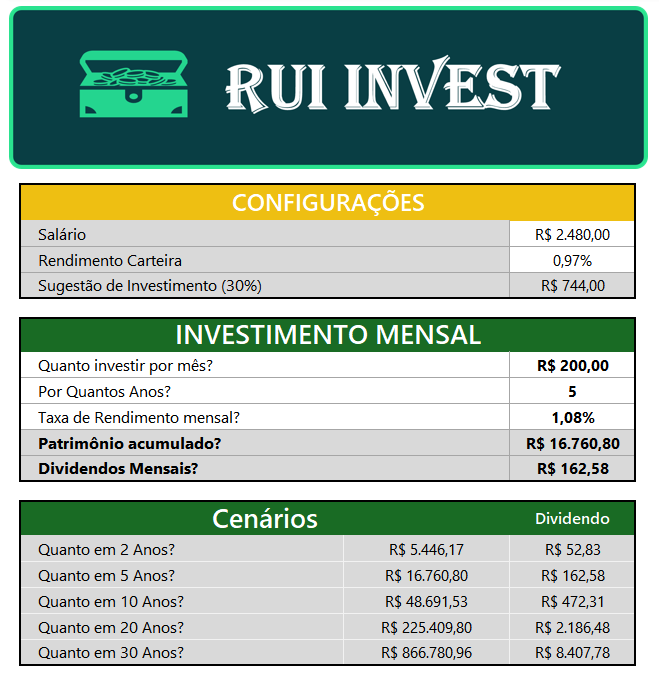
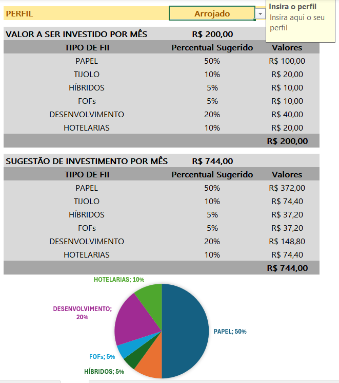

# Criando-uma-Ferramenta-de-Controle-de-Investimentos-com-Excel
Ferramenta simples em Excel para simular investimentos em fundos imobiliários

## DESCRIÇÃO

O projeto consiste na criação de uma ferramenta prática em Excel para simular investimentos em fundos imobiliários. 

## Perguntas de Negócio

+ Quanto investir por mês?
+ Por Quantos Anos?
+ Taxa de Rendimento mensal?
+ Qual o Patrimônio Acumulado?
+ Dividendos Mensais?
+ Qual a distribuição do valor a ser aportado em cada tipo de FII de acordo com o perfil de investidor?

A planilha permite calcular o valor total investido, o patrimônio acumulado e os dividendos mensais, ajudando o usuário a entender melhor o impacto de seus investimentos ao longo do tempo. Este modelo pode ser usado como base para futuras expansões e personalizações, oferecendo uma solução prática e acessível para investidores iniciantes.

De maneira intuitiva a planilha a partir das simulações auxilia o usuário a tomar decisões mais informadas sobre seus investimentos. A solução proposta visa automatizar cálculos complexos, como o valor total investido, o patrimônio acumulado e os dividendos mensais, proporcionando ao usuário uma visão clara de seu potencial retorno.

Projeto desenvolvido no bootcamp "**_Santander - Excel com Inteligência Artificial_**" oferecido pela **DIO Digital Innovation One (BR)**.
